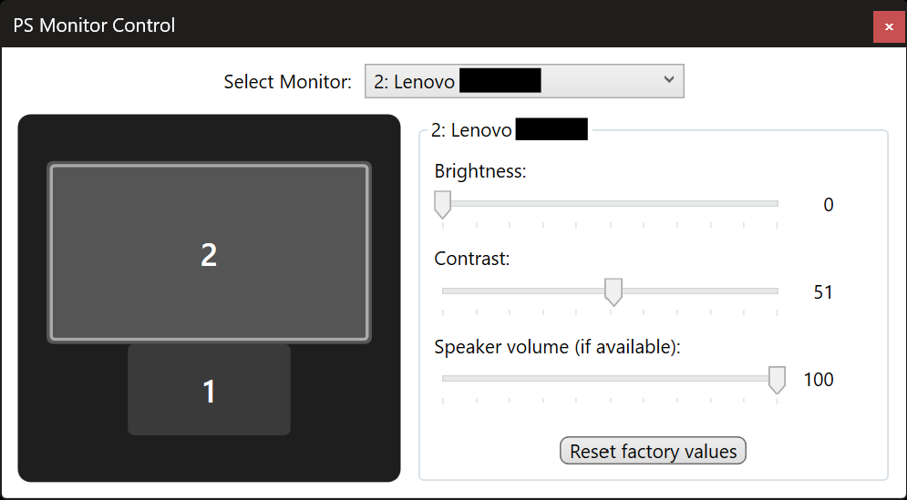

# PS Monitor Control (PowerShell GUI)

Lightweight PowerShell + WPF tool to control monitor settings (brightness, contrast, speaker volume) on Windows. Supports **external monitors** via DDC/CI and **internal laptop panels** via WMI brightness. Features a **visual monitor layout diagram** matching Windows Display Settings.

> **Note:** External monitors require DDC/CI enabled in their OSD. Internal (laptop) panels are controlled via Windows WMI and support **brightness only** (no contrast, volume, or factory reset).

---

## ✅ Current Features

* Auto‑detects connected DDC/CI capable external monitors
* Auto‑detects internal (laptop) displays via WMI brightness
* **Visual monitor layout diagram** — shows monitors in their real positions (like Windows Display Settings), with click-to-select
* **Windows display numbering** — monitors are numbered to match the Windows Display Settings (\\.\DISPLAY1 = 1, etc.)
* **DPI‑aware positioning** — uses per-monitor DPI awareness for accurate coordinates on mixed‑DPI setups
* Adjust **brightness**, **contrast**, and **(if supported) audio speaker volume** on external monitors
* Adjust **brightness** on internal laptop panels
* One‑click **factory reset** (DDC preset recall, external monitors only)
* Real‑time slider feedback
* Multi‑language UI (auto based on system locale): English, Spanish, French, German, Catalan (falls back to English)

---

## 🗣 Localization
The interface strings are embedded in the script; selection is automatic using the current UI culture two‑letter code. Unsupported languages revert to English. Feel free to submit a PR adding another language block to the `$Messages` hashtable.

---

## 📸 Screenshot

---

## 🚀 Quick Start

You can simply download the `PSMonitorControl.ps1` script and run it, or clone the repository:

Then:
1. Select a monitor from the drop‑down or click it in the layout diagram.
2. Move sliders to change brightness / contrast / volume (disabled if the monitor does not advertise that control).
3. Use the reset button to send a factory recall (careful—this applies on‑monitor defaults).

You can also right‑click the script in Explorer → "Run with PowerShell".

---

## 🔧 Requirements

* Windows 10 version 1607+ or Windows 11
* Compatible with both Windows PowerShell 5.1 and **PowerShell 7**
* .NET Framework (WPF is used for the UI)
* External monitor(s) with **DDC/CI enabled** in their on‑screen display (OSD)

---

## ❗ Limitations / Design Notes

* Internal (laptop) panels support **brightness only** via WMI—contrast, volume, and factory reset controls are disabled.
* Some external monitors expose only a subset of VCP (Virtual Control Panel) codes—sliders for unsupported features are disabled.
* Factory reset sends the standard VCP 0x04 "Restore Factory Defaults" (or equivalent). Not all monitors implement it uniformly. Not available for internal panels.
* Volume control only appears if the monitor reports an audio feature (e.g., built‑in speakers / audio passthrough supporting VCP 0x62 / 0x10 variants). If absent, the UI element is disabled.
* Multi‑monitor polling is on demand; there is no hot‑plug event watcher—restart the script after connecting new displays.
* Monitor layout diagram snaps nearly‑centered monitors for a cleaner visual; actual coordinates are unmodified.

---

## 🏗 Architecture

The script uses several C# helper classes loaded via `Add-Type`, each with an independent type guard so the script can be re-run in the same PowerShell session without conflicts:

| Class | Purpose |
|-------|---------|
| `MonitorControl` | DDC/CI P/Invoke: `EnumDisplayMonitors`, `GetPhysicalMonitors`, VCP read/write via `dxva2.dll` |
| `MonitorInfoHelper` | Maps HMONITOR → device name (e.g., `\\.\DISPLAY2`) via `GetMonitorInfo` |
| `DpiAwareBoundsHelper` | Retrieves monitor bounds using per-monitor DPI awareness (`SetThreadDpiAwarenessContext`) for accurate coordinates on mixed‑DPI setups |

---

## 🩺 Troubleshooting

| Symptom | Possible Cause | What To Try |
|---------|----------------|-------------|
| External monitor missing | DDC/CI disabled | Enable "DDC/CI" or "DDC" in monitor OSD and power‑cycle
| Laptop panel missing | WMI brightness not supported | Not all laptop panels expose WMI brightness control
| Sliders disabled | Feature not advertised | Confirm the monitor supports that VCP code (brightness 0x10, contrast 0x12)
| Contrast/Volume disabled on laptop | Expected behavior | Internal panels only support brightness via WMI
| Volume slider absent | No audio channel via DDC/CI | Test with manufacturer OSD; feature may not exist
| Reset button disabled | Internal panel selected | Factory reset is only available for DDC/CI external monitors
| Reset button does nothing | Vendor ignores factory recall | Not all firmware implements the same behavior
| Monitor positions wrong in diagram | DPI scaling mismatch | The script uses per-monitor DPI awareness; requires Windows 10 1607+
| Text not localized | Locale not included | Add a new language block to `$Messages` and submit PR

Additional debugging: Run the script with `-Verbose` (you can wrap internal logging if you extend the script) or insert temporary `Write-Host` calls around monitor enumeration.

---

## 🛠 Contributing

PRs welcome for:
* Additional languages
* Improved capability detection (e.g., robust querying of supported VCP codes)
* PowerShell 7 cross‑platform refinements (even though DDC/CI here is Windows‑specific via native calls)
* UI enhancements (dark theme, per‑monitor icons, etc.)

Please keep changes focused and include a brief description in the PR.

---

## 🔐 Security / Safety
The script uses P/Invoke to call Windows monitor APIs (`dxva2.dll`, `user32.dll`) and WMI queries (`root/WMI`) for internal panel brightness. No external network calls are made. Review the code before running if desired.

---

## 📄 License
Distributed under the terms in `LICENSE`.

---

## 🙋 FAQ
**Does this control HDR settings?** No—HDR tone mapping is separate from standard DDC brightness/contrast codes.

**Can it dim OLED reliably?** Depends on firmware; brightness may map to luminance limiter rather than pixel drive.

**Can I control contrast/volume on my laptop screen?** No—WMI only exposes brightness. Contrast and volume controls are DDC/CI features for external monitors.

**Why do I need English fallback?** Only implemented locales are loaded—others default to English.

**What do the numbers in the diagram mean?** They match the Windows Display Settings numbering (from `\\.\DISPLAY1`, `\\.\DISPLAY2`, etc.).

---

Enjoy controlling your displays! If this helps you, consider starring the repo.

